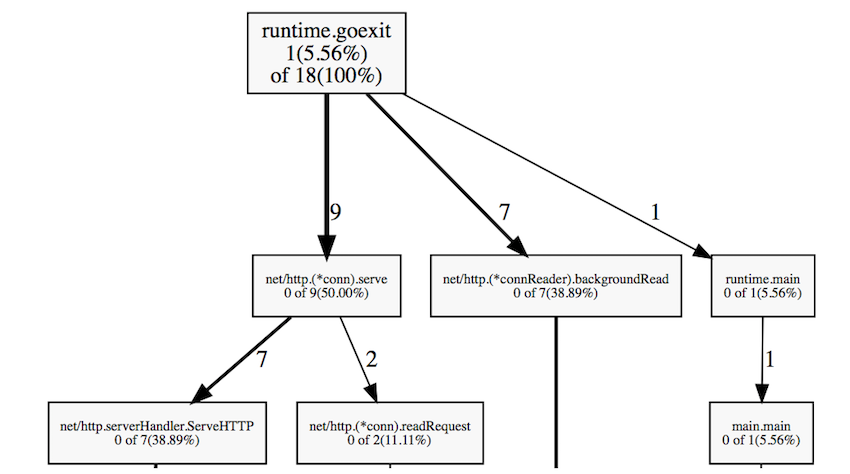
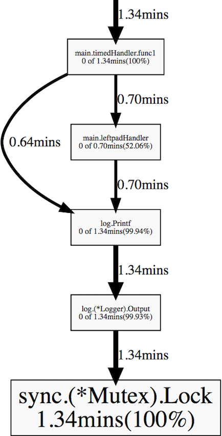

# Тестовый проект с использованием pprof
По материалам https://habr.com/ru/companies/badoo/articles/324682/
На английском: https://go.dev/blog/pprof

Go предоставляет низкоуровневый API для профилирования `runtime/pprof`, но если вы разрабатываете демон, то удобнее работать с высокоуровневым пакетом `net/http/pprof`.
Всё, что вам нужно для подключения профайлера, – импортировать `net/http/pprof`; необходимые HTTP-обработчики будут зарегистрированы автоматически:

```go
package main

import (
    "net/http"
    _ "net/http/pprof"
)

func hiHandler(w http.ResponseWriter, r *http.Request) {
    w.Write([]byte("hi"))
}

func main() {
    http.HandleFunc("/", hiHandler)
    http.ListenAndServe(":8080", nil)
}
```

Если ваше веб-приложение использует собственный URL-роутер, необходимо вручную зарегистрировать несколько pprof-адресов:

```go
package main

import (
    "net/http"
    "net/http/pprof"
)


func hiHandler(w http.ResponseWriter, r *http.Request) {
    w.Write([]byte("hi"))
}

func main() {
    r := http.NewServeMux()
    r.HandleFunc("/", hiHandler)

    // Регистрация pprof-обработчиков
    r.HandleFunc("/debug/pprof/", pprof.Index)
    r.HandleFunc("/debug/pprof/cmdline", pprof.Cmdline)
    r.HandleFunc("/debug/pprof/profile", pprof.Profile)
    r.HandleFunc("/debug/pprof/symbol", pprof.Symbol)
    r.HandleFunc("/debug/pprof/trace", pprof.Trace)

    http.ListenAndServe(":8080", r)
}
```

Вот и всё. Запустите приложение, а затем используйте pprof tool:
```bash
go tool pprof [binary] http://127.0.0.1:8080/debug/pprof/profile
```
Одним из самых больших преимуществ pprof является то, что благодаря низким накладным расходам он может использоваться в продакшне без каких-либо заметных потерь производительности.

Но прежде чем углубляться в подробности работы pprof, рассмотрим на реальном примере, как можно выявить и решить проблемы с производительностью в Go.

# Пример: микросервис left-pad

Предположим, вы разрабатываете совершенно новый микросервис, который заданными символами дополняет заданную строку с левого края до заданной длины:
```bash
curl "http://127.0.0.1:8080/v1/leftpad/?str=test&len=10&chr=*"
```
Вывод:
```
{"str":"******test"}
```

Сервис должен собирать статистику: количество входящих запросов и продолжительность каждого запроса. 
Предполагается, что все собранные данные отправляются в агрегатор метрик (например, [StatsD](https://github.com/statsd/statsd)). 
Кроме того, сервису необходимо логировать параметры запроса: URL, IP-адрес и User Agent.

Компилируем и запускаем приложение:
```bash
go build
```

# Измерение производительности

Нам нужно определить, сколько запросов в секунду может обслуживать наш микросервис. Это можно сделать с помощью ab – `Apache benchmarking tool`:
```bash
ab -k -c 8 -n 100000 "http://127.0.0.1:8080/v1/leftpad/?str=test&len=50&chr=*"
# -k   Включить постоянное HTTP-соединение (KeepAlive)
# -c   Количество одновременных запросов
# -n   Количество запросов, которое будет делать ab
```

Неплохо, но может быть быстрее:
```
Requests per second:    22810.15 [#/sec] (mean)
Time per request:       0.042 [ms] (mean, across all concurrent requests)
```

# Профилирование CPU
Снова запускаем `Apache benchmarking tool`, но уже с большим количеством запросов (1 млн должно быть достаточно). И одновременно запускаем `pprof`:
```bash
go tool pprof goprofex http://127.0.0.1:8080/debug/pprof/profile
```

Профайлер CPU по умолчанию работает в течение 30 секунд. 
Он использует выборку, чтобы определить, какие функции тратят большую часть процессорного времени. 
Рантайм Go останавливает выполнение каждые десять миллисекунд и записывает текущий стек вызовов всех работающих горутин.

Когда pprof перейдёт в интерактивный режим, введите top, чтобы увидеть список функций, которые в процентном соотношении больше всего присутствовали в полученной выборке. 
В нашем случае все эти функции из стандартной библиотеки и библиотеки времени выполнения (runtime), что для нас неинформативно:
```
(pprof) top
63.77s of 69.02s total (92.39%)
Dropped 331 nodes (cum <= 0.35s)
Showing top 10 nodes out of 78 (cum >= 0.64s)
      flat  flat%   sum%        cum   cum%
    50.79s 73.59% 73.59%     50.92s 73.78%  syscall.Syscall
     4.66s  6.75% 80.34%      4.66s  6.75%  runtime.kevent
     2.65s  3.84% 84.18%      2.65s  3.84%  runtime.usleep
     1.88s  2.72% 86.90%      1.88s  2.72%  runtime.freedefer
     1.31s  1.90% 88.80%      1.31s  1.90%  runtime.mach_semaphore_signal
     1.10s  1.59% 90.39%      1.10s  1.59%  runtime.mach_semaphore_wait
     0.51s  0.74% 91.13%      0.61s  0.88%  log.(*Logger).formatHeader
     0.49s  0.71% 91.84%      1.06s  1.54%  runtime.mallocgc
     0.21s   0.3% 92.15%      0.56s  0.81%  runtime.concatstrings
     0.17s  0.25% 92.39%      0.64s  0.93%  fmt.(*pp).doPrintf
```

Есть более наглядный способ, который позволяет решить эту проблему – команда web. Она генерирует граф вызовов в формате SVG и открывает его в веб-браузере:


Из этого графа видно, что заметную часть процессорного времени приложение затрачивает на ведение лога и сбор метрик. Ещё некоторое время тратится на сборку мусора.


С помощью команды `list` можно подробно исследовать каждую функцию, например, `list leftpad`:
```
(pprof) list leftpad
ROUTINE ================= main.leftpad in /Users/artem/go/src/github.com/akrylysov/goprofex/leftpad.go
      20ms      490ms (flat, cum)  0.71% of Total
         .          .      3:func leftpad(s string, length int, char rune) string {
         .          .      4:   for len(s) < length {
      20ms      490ms      5:       s = string(char) + s
         .          .      6:   }
         .          .      7:   return s
         .          .      8:}
```
Для тех, кто не боится смотреть на дизассемблированный код, pprof включает команду `disasm`, выводящую фактические инструкции процессора:
```
(pprof) disasm leftpad
ROUTINE ======================== main.leftpad
      20ms      490ms (flat, cum)  0.71% of Total
         .          .    1312ab0: GS MOVQ GS:0x8a0, CX
         .          .    1312ab9: CMPQ 0x10(CX), SP
         .          .    1312abd: JBE 0x1312b5e
         .          .    1312ac3: SUBQ $0x48, SP
         .          .    1312ac7: MOVQ BP, 0x40(SP)
         .          .    1312acc: LEAQ 0x40(SP), BP
         .          .    1312ad1: MOVQ 0x50(SP), AX
         .          .    1312ad6: MOVQ 0x58(SP), CX
...
```

# Профилирование кучи
```bash
go tool pprof goprofex http://127.0.0.1:8080/debug/pprof/heap
```
По умолчанию он показывает объём используемой памяти:
```
(pprof) top
512.17kB of 512.17kB total (  100%)
Dropped 85 nodes (cum <= 2.56kB)
Showing top 10 nodes out of 13 (cum >= 512.17kB)
flat  flat%   sum%        cum   cum%
512.17kB   100%   100%   512.17kB   100%  runtime.mapassign
0     0%   100%   512.17kB   100%  main.leftpadHandler
0     0%   100%   512.17kB   100%  main.timedHandler.func1
0     0%   100%   512.17kB   100%  net/http.(*Request).FormValue
0     0%   100%   512.17kB   100%  net/http.(*Request).ParseForm
0     0%   100%   512.17kB   100%  net/http.(*Request).ParseMultipartForm
0     0%   100%   512.17kB   100%  net/http.(*ServeMux).ServeHTTP
0     0%   100%   512.17kB   100%  net/http.(*conn).serve
0     0%   100%   512.17kB   100%  net/http.HandlerFunc.ServeHTTP
0     0%   100%   512.17kB   100%  net/http.serverHandler.ServeHTTP
```
Но нас больше интересует количество размещённых в куче объектов. Запустим pprof с опцией `-alloc_objects`:
```bash
go tool pprof -alloc_objects goprofex http://127.0.0.1:8080/debug/pprof/heap
```

Почти 70% всех объектов были созданы двумя функциям – `leftpad` и `StatsD.Send`. Изучим их подробнее:

```
(pprof) top
559346486 of 633887751 total (88.24%)
Dropped 32 nodes (cum <= 3169438)
Showing top 10 nodes out of 46 (cum >= 14866706)
      flat  flat%   sum%        cum   cum%
 218124937 34.41% 34.41%  218124937 34.41%  main.leftpad
 116692715 18.41% 52.82%  218702222 34.50%  main.(*StatsD).Send
  52326692  8.25% 61.07%   57278218  9.04%  fmt.Sprintf
  39437390  6.22% 67.30%   39437390  6.22%  strconv.FormatFloat
  30689052  4.84% 72.14%   30689052  4.84%  strings.NewReplacer
  29869965  4.71% 76.85%   29968270  4.73%  net/textproto.(*Reader).ReadMIMEHeader
  20441700  3.22% 80.07%   20441700  3.22%  net/url.parseQuery
  19071266  3.01% 83.08%  374683692 59.11%  main.leftpadHandler
  17826063  2.81% 85.90%  558753994 88.15%  main.timedHandler.func1
  14866706  2.35% 88.24%   14866706  2.35%  net/http.Header.clone
```

Другими полезными параметрами для решения проблем с памятью являются:
- `-inuse_objects`, показывающий количество объектов в памяти;
- `-alloc_space`, показывающий, сколько памяти было выделено с момента запуска программы.

Автоматическое управление памятью – вещь удобная, но в мире, увы, нет ничего бесплатного. 
Выделение памяти на куче не только значительно медленнее, чем выделение на стеке, но ещё и косвенно влияет на производительность. 
Каждый фрагмент памяти, который вы выделяете в куче, добавляет работы сборщику мусора и заставляет использовать больше ресурсов процессора. 
Единственный способ заставить приложение тратить меньше времени на сборку мусора – сократить количество аллокаций.

# Escape-анализ
Всякий раз, когда вы используете оператор & для получения указателя на переменную или выделяете память для нового значения с помощью make или new, они не обязательно размещаются в куче:

```go
func foo(a []string) {
      fmt.Println(len(a))
}

func main() {
      foo(make([]string, 8))
}
```

В приведённом выше примере make([]string, 8) выделяет память в стеке. 
Go использует escape-анализ, чтобы определить, можно ли безопасно выделить память в стеке вместо кучи. 
Вы можете добавить опцию -gcflags=-m, чтобы увидеть результаты escape-анализа:
```
5  type X struct {v int}
6
7  func foo(x *X) {
8       fmt.Println(x.v)
9  }
10
11 func main() {
12      x := &X{1}
13      foo(x)
14 }

go build -gcflags=-m
./main.go:7: foo x does not escape
./main.go:12: main &X literal does not escape
```

Компилятор Go достаточно умён, чтобы в некоторых случаях вместо выделения памяти в куче использовать стек. 
Но ситуация ухудшается, когда вы начинаете работать, например, с интерфейсами:

```go
// Пример 1
type Fooer interface {
      foo(a []string)
}

type FooerX struct{}

func (FooerX) foo(a []string) {
      fmt.Println(len(a))
}

func main() {
      a := make([]string, 8) // make([]string, 8) escapes to heap
      var fooer Fooer
      fooer = FooerX{}
      fooer.foo(a)
}

// Пример 2
func foo(a interface{}) string {
      return a.(fmt.Stringer).String()
}

func main() {
      foo(make([]string, 8)) // make([]string, 8) escapes to heap
}
```

В статье Дмитрия Вьюкова [Go Escape Analysis Flaws](https://docs.google.com/document/d/1CxgUBPlx9iJzkz9JWkb6tIpTe5q32QDmz8l0BouG0Cw/view) описаны и другие случаи, когда escape-анализ недостаточно хорош, чтобы понять, безопасно ли выделять память в стеке.
Вообще для небольших структур, которые вам не нужно изменять, предпочтительно использовать передачу по значению, а не по ссылке.

_Примечание: для больших структур дешевле передать указатель, чем скопировать всю структуру и передать её по значению._

# Профилирование горутин

При запуске профайлера горутин получаем их стек вызова и количество работающих горутин:

```bash
go tool pprof goprofex http://127.0.0.1:8080/debug/pprof/goroutine
```



На графе отображено только 18 активных горутин, что очень мало. 
Нередко можно встретить тысячи запущенных горутин без существенного ухудшения производительности.

# Профилирование блокировок

Профайлер блокировок показывает, где в программе происходят задержки из-за блокировок, вызванных такими объектами синхронизации, как мьютексы и каналы.

Перед запуском профайлера блокировок необходимо с помощью функции [`runtime.SetBlockProfileRate`](https://golang.org/pkg/runtime/#SetBlockProfileRate) установить уровень профилирования. 
Вы можете добавить её вызов в свою функцию `main` или `init`.
```bash
go tool pprof goprofex http://127.0.0.1:8080/debug/pprof/block
```



`timedHandler` и `leftpadHandler` тратят много времени на мьютексы внутри `log.Printf`. 
Причина в том, что реализация пакета log использует мьютекс, чтобы синхронизировать доступ к файлу, совместно используемому несколькими горутинами.

# Бенчмаркинг

Как отмечалось выше, самыми большими нарушителями с точки зрения производительности являются функции пакетов `log`, `leftpad` и `StatsD.Send`. 
Мы нашли узкое место. Но прежде чем приступать к оптимизации, необходимо разработать воспроизводимый способ измерения производительности интересующего нас кода. 
Такой механизм включён в пакет [testing](https://golang.org/pkg/testing/). Нужно создать функцию вида func BenchmarkXxx(*testing.B) в тестовом файле:
```go
func BenchmarkStatsD(b *testing.B) {
    statsd := StatsD{
        Namespace:  "namespace",
        SampleRate: 0.5,
    }
    for i := 0; i < b.N; i++ {
        statsd.Incr("test")
    }
}
```

Также можно с использованием пакета net/http/httptest провести бенчмаркинг всего HTTP-обработчика:
```go
func BenchmarkLeftpadHandler(b *testing.B) {
    r := httptest.NewRequest("GET", "/v1/leftpad/?str=test&len=50&chr=*", nil)
    for i := 0; i < b.N; i++ {
        w := httptest.NewRecorder()
        leftpadHandler(w, r)
    }
}
```
Запускаем бенчмарк:
```bash
go test -bench=. -benchmem
```

Он показывает время, занимаемое каждой итерацией, а также объём и количество выделений памяти:
```
BenchmarkTimedHandler-4           200000          6511 ns/op        1621 B/op         41 allocs/op
BenchmarkLeftpadHandler-4         200000         10546 ns/op        3297 B/op         75 allocs/op
BenchmarkLeftpad10-4             5000000           339 ns/op          64 B/op          6 allocs/op
BenchmarkLeftpad50-4              500000          3079 ns/op        1568 B/op         46 allocs/op
BenchmarkStatsD-4                1000000          1516 ns/op         560 B/op         15 allocs/op
```