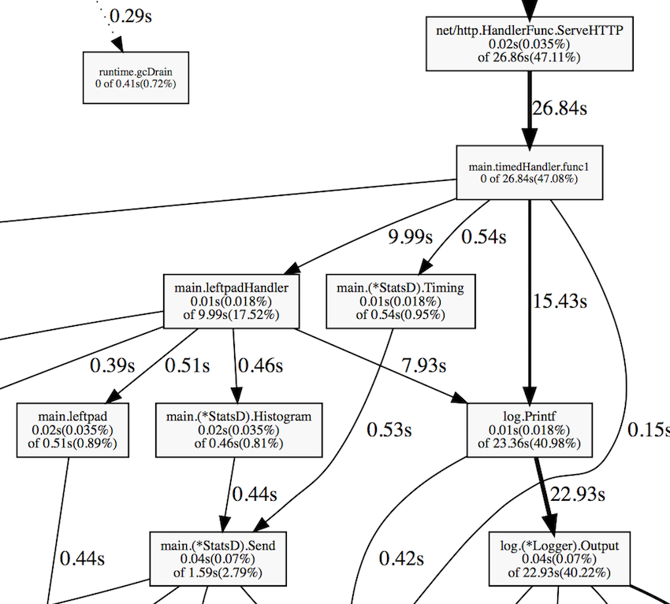

# Тестовый проект с использованием pprof
По материалам https://habr.com/ru/companies/badoo/articles/324682/
На английском: https://go.dev/blog/pprof

Go предоставляет низкоуровневый API для профилирования ```runtime/pprof```, но если вы разрабатываете демон, то удобнее работать с высокоуровневым пакетом ```net/http/pprof```.
Всё, что вам нужно для подключения профайлера, – импортировать ```net/http/pprof```; необходимые HTTP-обработчики будут зарегистрированы автоматически:

```go
package main

import (
    "net/http"
    _ "net/http/pprof"
)

func hiHandler(w http.ResponseWriter, r *http.Request) {
    w.Write([]byte("hi"))
}

func main() {
    http.HandleFunc("/", hiHandler)
    http.ListenAndServe(":8080", nil)
}
```

Если ваше веб-приложение использует собственный URL-роутер, необходимо вручную зарегистрировать несколько pprof-адресов:

```go
package main

import (
    "net/http"
    "net/http/pprof"
)


func hiHandler(w http.ResponseWriter, r *http.Request) {
    w.Write([]byte("hi"))
}

func main() {
    r := http.NewServeMux()
    r.HandleFunc("/", hiHandler)

    // Регистрация pprof-обработчиков
    r.HandleFunc("/debug/pprof/", pprof.Index)
    r.HandleFunc("/debug/pprof/cmdline", pprof.Cmdline)
    r.HandleFunc("/debug/pprof/profile", pprof.Profile)
    r.HandleFunc("/debug/pprof/symbol", pprof.Symbol)
    r.HandleFunc("/debug/pprof/trace", pprof.Trace)

    http.ListenAndServe(":8080", r)
}
```

Вот и всё. Запустите приложение, а затем используйте pprof tool:
```bash
go tool pprof [binary] http://127.0.0.1:8080/debug/pprof/profile
```
Одним из самых больших преимуществ pprof является то, что благодаря низким накладным расходам он может использоваться в продакшне без каких-либо заметных потерь производительности.

Но прежде чем углубляться в подробности работы pprof, рассмотрим на реальном примере, как можно выявить и решить проблемы с производительностью в Go.

# Пример: микросервис left-pad

Предположим, вы разрабатываете совершенно новый микросервис, который заданными символами дополняет заданную строку с левого края до заданной длины:
```bash
curl "http://127.0.0.1:8080/v1/leftpad/?str=test&len=10&chr=*"
```
Вывод:
```
{"str":"******test"}
```

Сервис должен собирать статистику: количество входящих запросов и продолжительность каждого запроса. 
Предполагается, что все собранные данные отправляются в агрегатор метрик (например, StatsD https://github.com/statsd/statsd). 
Кроме того, сервису необходимо логировать параметры запроса: URL, IP-адрес и User Agent.

Компилируем и запускаем приложение:
```bash
go build
```

# Измерение производительности

Нам нужно определить, сколько запросов в секунду может обслуживать наш микросервис. Это можно сделать с помощью ab – ```Apache benchmarking tool```:
```bash
ab -k -c 8 -n 100000 "http://127.0.0.1:8080/v1/leftpad/?str=test&len=50&chr=*"
# -k   Включить постоянное HTTP-соединение (KeepAlive)
# -c   Количество одновременных запросов
# -n   Количество запросов, которое будет делать ab
```

Неплохо, но может быть быстрее:
```
Requests per second:    22810.15 [#/sec] (mean)
Time per request:       0.042 [ms] (mean, across all concurrent requests)
```

# Профилирование CPU
Снова запускаем ```Apache benchmarking tool```, но уже с большим количеством запросов (1 млн должно быть достаточно). И одновременно запускаем ```pprof```:
```bash
go tool pprof goprofex http://127.0.0.1:8080/debug/pprof/profile
```

Профайлер CPU по умолчанию работает в течение 30 секунд. 
Он использует выборку, чтобы определить, какие функции тратят большую часть процессорного времени. 
Рантайм Go останавливает выполнение каждые десять миллисекунд и записывает текущий стек вызовов всех работающих горутин.


Когда pprof перейдёт в интерактивный режим, введите top, чтобы увидеть список функций, которые в процентном соотношении больше всего присутствовали в полученной выборке. 
В нашем случае все эти функции из стандартной библиотеки и библиотеки времени выполнения (runtime), что для нас неинформативно:
```
(pprof) top
63.77s of 69.02s total (92.39%)
Dropped 331 nodes (cum <= 0.35s)
Showing top 10 nodes out of 78 (cum >= 0.64s)
      flat  flat%   sum%        cum   cum%
    50.79s 73.59% 73.59%     50.92s 73.78%  syscall.Syscall
     4.66s  6.75% 80.34%      4.66s  6.75%  runtime.kevent
     2.65s  3.84% 84.18%      2.65s  3.84%  runtime.usleep
     1.88s  2.72% 86.90%      1.88s  2.72%  runtime.freedefer
     1.31s  1.90% 88.80%      1.31s  1.90%  runtime.mach_semaphore_signal
     1.10s  1.59% 90.39%      1.10s  1.59%  runtime.mach_semaphore_wait
     0.51s  0.74% 91.13%      0.61s  0.88%  log.(*Logger).formatHeader
     0.49s  0.71% 91.84%      1.06s  1.54%  runtime.mallocgc
     0.21s   0.3% 92.15%      0.56s  0.81%  runtime.concatstrings
     0.17s  0.25% 92.39%      0.64s  0.93%  fmt.(*pp).doPrintf
```

Есть более наглядный способ, который позволяет решить эту проблему – команда web. Она генерирует граф вызовов в формате SVG и открывает его в веб-браузере:


Из этого графа видно, что заметную часть процессорного времени приложение затрачивает на ведение лога и сбор метрик. Ещё некоторое время тратится на сборку мусора.


С помощью команды ```list``` можно подробно исследовать каждую функцию, например, ```list leftpad```:
```
(pprof) list leftpad
ROUTINE ================= main.leftpad in /Users/artem/go/src/github.com/akrylysov/goprofex/leftpad.go
      20ms      490ms (flat, cum)  0.71% of Total
         .          .      3:func leftpad(s string, length int, char rune) string {
         .          .      4:   for len(s) < length {
      20ms      490ms      5:       s = string(char) + s
         .          .      6:   }
         .          .      7:   return s
         .          .      8:}
```
Для тех, кто не боится смотреть на дизассемблированный код, pprof включает команду ```disasm```, выводящую фактические инструкции процессора:
```
(pprof) disasm leftpad
ROUTINE ======================== main.leftpad
      20ms      490ms (flat, cum)  0.71% of Total
         .          .    1312ab0: GS MOVQ GS:0x8a0, CX
         .          .    1312ab9: CMPQ 0x10(CX), SP
         .          .    1312abd: JBE 0x1312b5e
         .          .    1312ac3: SUBQ $0x48, SP
         .          .    1312ac7: MOVQ BP, 0x40(SP)
         .          .    1312acc: LEAQ 0x40(SP), BP
         .          .    1312ad1: MOVQ 0x50(SP), AX
         .          .    1312ad6: MOVQ 0x58(SP), CX
...
```

# Профилирование кучи
```bash
go tool pprof goprofex http://127.0.0.1:8080/debug/pprof/heap
```
По умолчанию он показывает объём используемой памяти:
```
(pprof) top
512.17kB of 512.17kB total (  100%)
Dropped 85 nodes (cum <= 2.56kB)
Showing top 10 nodes out of 13 (cum >= 512.17kB)
flat  flat%   sum%        cum   cum%
512.17kB   100%   100%   512.17kB   100%  runtime.mapassign
0     0%   100%   512.17kB   100%  main.leftpadHandler
0     0%   100%   512.17kB   100%  main.timedHandler.func1
0     0%   100%   512.17kB   100%  net/http.(*Request).FormValue
0     0%   100%   512.17kB   100%  net/http.(*Request).ParseForm
0     0%   100%   512.17kB   100%  net/http.(*Request).ParseMultipartForm
0     0%   100%   512.17kB   100%  net/http.(*ServeMux).ServeHTTP
0     0%   100%   512.17kB   100%  net/http.(*conn).serve
0     0%   100%   512.17kB   100%  net/http.HandlerFunc.ServeHTTP
0     0%   100%   512.17kB   100%  net/http.serverHandler.ServeHTTP
```
Но нас больше интересует количество размещённых в куче объектов. Запустим pprof с опцией ```-alloc_objects```:
```bash
go tool pprof -alloc_objects goprofex http://127.0.0.1:8080/debug/pprof/heap
```